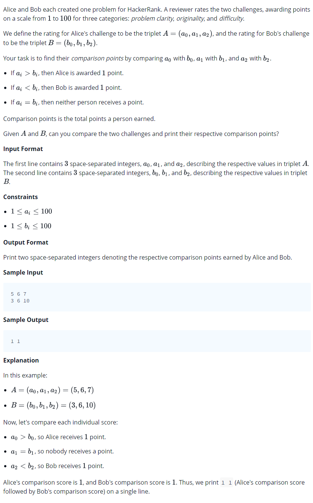

# 0003 [Compare the Triplets](https://www.hackerrank.com/challenges/compare-the-triplets/problem)



## C

```c
#include <math.h>
#include <stdio.h>
#include <string.h>
#include <stdlib.h>
#include <assert.h>
#include <limits.h>
#include <stdbool.h>

int* solve(int a0, int a1, int a2, int b0, int b1, int b2, int *result_size){
    // Complete this function
}

int main() {
    int a0;
    int a1;
    int a2;
    scanf("%d %d %d", &a0, &a1, &a2);
    int b0;
    int b1;
    int b2;
    scanf("%d %d %d", &b0, &b1, &b2);
    int result_size;
    int* result = solve(a0, a1, a2, b0, b1, b2, &result_size);
    for(int result_i = 0; result_i < result_size; result_i++) {
        if(result_i) {
            printf(" ");
        }
        printf("%d", result[result_i]);
    }
    puts("");

    return 0;
}
```

## C++

```cpp
#include <bits/stdc++.h>

using namespace std;

vector < int > solve(int a0, int a1, int a2, int b0, int b1, int b2){
    // Complete this function
}

int main() {
    int a0;
    int a1;
    int a2;
    cin >> a0 >> a1 >> a2;
    int b0;
    int b1;
    int b2;
    cin >> b0 >> b1 >> b2;
    vector < int > result = solve(a0, a1, a2, b0, b1, b2);
    for (ssize_t i = 0; i < result.size(); i++) {
        cout << result[i] << (i != result.size() - 1 ? " " : "");
    }
    cout << endl;
    

    return 0;
}
```