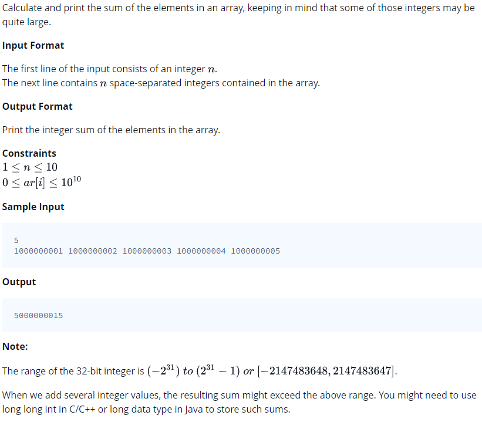

# 0004 [A Very Big Sum](https://www.hackerrank.com/challenges/a-very-big-sum/problem)



```c
#include <math.h>
#include <stdio.h>
#include <string.h>
#include <stdlib.h>
#include <assert.h>
#include <limits.h>
#include <stdbool.h>

long int aVeryBigSum(int n, int ar_size, long int* ar) {
    // Complete this function
}

int main() {
    int n;
    scanf("%i", &n);
    long int *ar = malloc(sizeof(long int) * n);
    for(int ar_i = 0; ar_i < n; ar_i++){
       scanf("%li",&ar[ar_i]);
    }
    long int result = aVeryBigSum(n, n, ar);
    printf("%ld\n", result);
    return 0;
}
```
