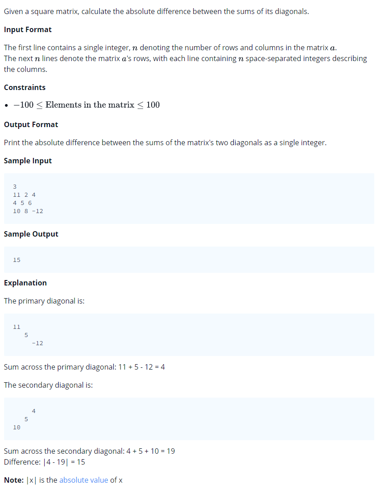

# 0005 [Diagonal Difference](https://www.hackerrank.com/challenges/diagonal-difference/problem)



## C

```c
#include <math.h>
#include <stdio.h>
#include <string.h>
#include <stdlib.h>
#include <assert.h>
#include <limits.h>
#include <stdbool.h>

int diagonalDifference(int a_size_rows, int a_size_cols, int** a) {
    // Complete this function
}

int main() {
    int n;
    scanf("%i", &n);
    int a[n][n];
    for (int a_i = 0; a_i < n; a_i++) {
       for (int a_j = 0; a_j < n; a_j++) {

          scanf("%i",&a[a_i][a_j]);
       }
    }
    int result = diagonalDifference(n, n, a);
    printf("%d\n", result);
    return 0;
}
```

## C++

```cpp
#include <bits/stdc++.h>

using namespace std;

int diagonalDifference(vector < vector<int> > a) {
    // Complete this function
}

int main() {
    int n;
    cin >> n;
    vector< vector<int> > a(n,vector<int>(n));
    for(int a_i = 0;a_i < n;a_i++){
       for(int a_j = 0;a_j < n;a_j++){
          cin >> a[a_i][a_j];
       }
    }
    int result = diagonalDifference(a);
    cout << result << endl;
    return 0;
}
```

## Python 3

```python
#!/bin/python3

import sys

def diagonalDifference(a):
    # Complete this function

if __name__ == "__main__":
    n = int(input().strip())
    a = []
    for a_i in range(n):
       a_t = [int(a_temp) for a_temp in input().strip().split(' ')]
       a.append(a_t)
    result = diagonalDifference(a)
    print(result)
```