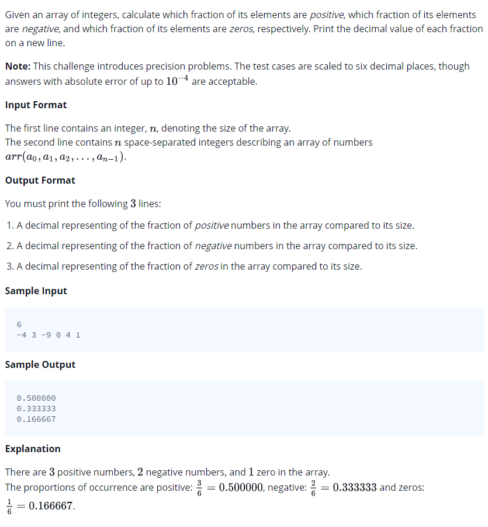

# 0006 [Plus Minus](https://www.hackerrank.com/challenges/plus-minus/problem)



## C

```c
#include <math.h>
#include <stdio.h>
#include <string.h>
#include <stdlib.h>
#include <assert.h>
#include <limits.h>
#include <stdbool.h>

void plusMinus(int arr_size, int* arr) {
    // Complete this function
}

int main() {
    int n;
    scanf("%i", &n);
    int *arr = malloc(sizeof(int) * n);
    for (int arr_i = 0; arr_i < n; arr_i++) {
       scanf("%i",&arr[arr_i]);
    }
    plusMinus(n, arr);
    return 0;
}
```

## C++

```cpp
#include <bits/stdc++.h>

using namespace std;

void plusMinus(vector <int> arr) {
    // Complete this function
}

int main() {
    int n;
    cin >> n;
    vector<int> arr(n);
    for(int arr_i = 0; arr_i < n; arr_i++){
       cin >> arr[arr_i];
    }
    plusMinus(arr);
    return 0;
}
```

## Python 3

```python
#!/bin/python3

import sys

def plusMinus(arr):
    # Complete this function

if __name__ == "__main__":
    n = int(input().strip())
    arr = list(map(int, input().strip().split(' ')))
    plusMinus(arr)
```