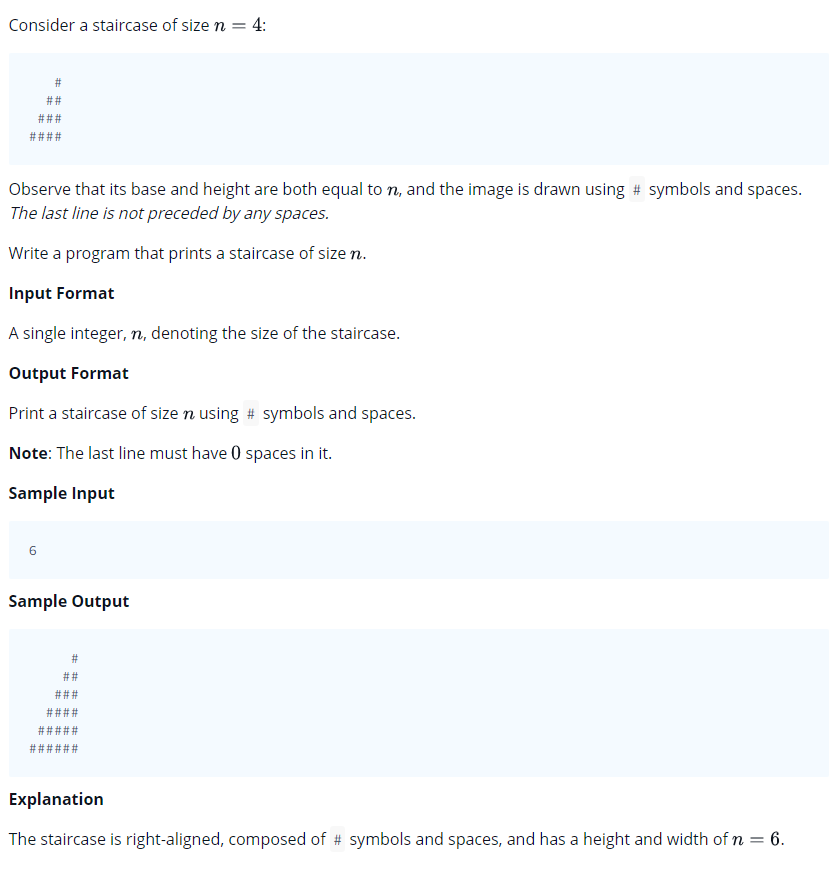

# 0007 [Staircase](https://www.hackerrank.com/challenges/staircase/problem)



## C

```c
#include <math.h>
#include <stdio.h>
#include <string.h>
#include <stdlib.h>
#include <assert.h>
#include <limits.h>
#include <stdbool.h>

void staircase(int n) {
    // Complete this function
}

int main() {
    int n;
    scanf("%i", &n);
    staircase(n);
    return 0;
}
```

## C++

```cpp
#include <bits/stdc++.h>

using namespace std;

void staircase(int n) {
    // Complete this function
}

int main() {
    int n;
    cin >> n;
    staircase(n);
    return 0;
}
```

## Python 3

```py3
#!/bin/python3

import sys

def staircase(n):
    # Complete this function

if __name__ == "__main__":
    n = int(input().strip())
    staircase(n)
```