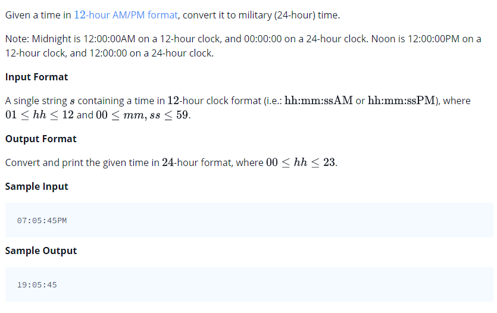

# 0010 [Time Conversion](https://www.hackerrank.com/challenges/time-conversion/problem)



## C

```c
#include <math.h>
#include <stdio.h>
#include <string.h>
#include <stdlib.h>
#include <assert.h>
#include <limits.h>
#include <stdbool.h>

char* timeConversion(char* s) {
    // Complete this function
}

int main() {
    char* s = (char *)malloc(512000 * sizeof(char));
    scanf("%s", s);
    int result_size;
    char* result = timeConversion(s);
    printf("%s\n", result);
    return 0;
}
```

## C++

```cpp
#include <bits/stdc++.h>

using namespace std;

string timeConversion(string s) {
    // Complete this function
}

int main() {
    string s;
    cin >> s;
    string result = timeConversion(s);
    cout << result << endl;
    return 0;
}
```

## Python 3

```py3
#!/bin/python3

import sys

def timeConversion(s):
    # Complete this function

s = input().strip()
result = timeConversion(s)
print(result)
```