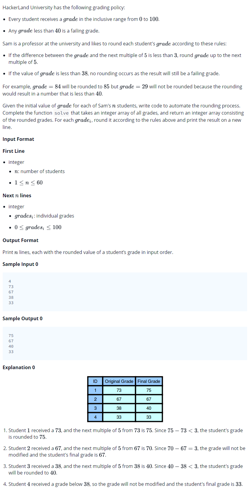

# 0011 [Grading Students](https://www.hackerrank.com/challenges/grading/problem)



## C

```c
#include <math.h>
#include <stdio.h>
#include <string.h>
#include <stdlib.h>
#include <assert.h>
#include <limits.h>
#include <stdbool.h>

int* solve(int grades_size, int* grades, int *result_size){
    // Complete this function
}

int main() {
    int n;
    scanf("%d", &n);
    int *grades = malloc(sizeof(int) * n);
    for(int grades_i = 0; grades_i < n; grades_i++){
       scanf("%d",&grades[grades_i]);
    }
    int result_size;
    int* result = solve(n, grades, &result_size);
    for(int result_i = 0; result_i < result_size; result_i++) {
        if(result_i) {
            printf("\n");
        }
        printf("%d", result[result_i]);
    }
    puts("");

    return 0;
}
```

## C++

```cpp
#include <bits/stdc++.h>

using namespace std;

vector < int > solve(vector < int > grades){
    // Complete this function
}

int main() {
    int n;
    cin >> n;
    vector<int> grades(n);
    for(int grades_i = 0; grades_i < n; grades_i++){
       cin >> grades[grades_i];
    }
    vector < int > result = solve(grades);
    for (ssize_t i = 0; i < result.size(); i++) {
        cout << result[i] << (i != result.size() - 1 ? "\n" : "");
    }
    cout << endl;

    return 0;
}
```

## Python 3

```py3
#!/bin/python3

import sys

def solve(grades):
    # Complete this function

n = int(input().strip())
grades = []
grades_i = 0
for grades_i in range(n):
    grades_t = int(input().strip())
    grades.append(grades_t)
result = solve(grades)
print ("\n".join(map(str, result)))
```