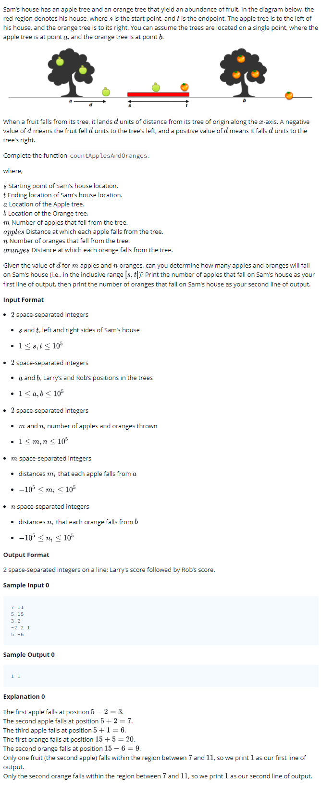

# 0012 [Apple and Orange](https://www.hackerrank.com/challenges/apple-and-orange/problem)



## C

```c
#include <math.h>
#include <stdio.h>
#include <string.h>
#include <stdlib.h>
#include <assert.h>
#include <limits.h>
#include <stdbool.h>

void countApplesAndOranges(int s, int t, int a, int b, int apples_size, int* apples, int oranges_size, int* oranges) {
    // Complete this function
}

int main() {
    int s; 
    int t; 
    scanf("%i %i", &s, &t);
    int a; 
    int b; 
    scanf("%i %i", &a, &b);
    int m; 
    int n; 
    scanf("%i %i", &m, &n);
    int *apple = malloc(sizeof(int) * m);
    for (int apple_i = 0; apple_i < m; apple_i++) {
       scanf("%i",&apple[apple_i]);
    }
    int *orange = malloc(sizeof(int) * n);
    for (int orange_i = 0; orange_i < n; orange_i++) {
       scanf("%i",&orange[orange_i]);
    }
    countApplesAndOranges(s, t, a, b, apple, orange);
    return 0;
}
```

## C++

```cpp
#include <bits/stdc++.h>

using namespace std;

void countApplesAndOranges(int s, int t, int a, int b, vector <int> apples, vector <int> oranges) {
    // Complete this function
}

int main() {
    int s;
    int t;
    cin >> s >> t;
    int a;
    int b;
    cin >> a >> b;
    int m;
    int n;
    cin >> m >> n;
    vector<int> apple(m);
    for(int apple_i = 0; apple_i < m; apple_i++){
       cin >> apple[apple_i];
    }
    vector<int> orange(n);
    for(int orange_i = 0; orange_i < n; orange_i++){
       cin >> orange[orange_i];
    }
    countApplesAndOranges(s, t, a, b, apple, orange);
    return 0;
}
```

## Python 3

```py3
#!/bin/python3

import sys

def countApplesAndOranges(s, t, a, b, apples, oranges):
    # Complete this function

if __name__ == "__main__":
    s, t = input().strip().split(' ')
    s, t = [int(s), int(t)]
    a, b = input().strip().split(' ')
    a, b = [int(a), int(b)]
    m, n = input().strip().split(' ')
    m, n = [int(m), int(n)]
    apple = list(map(int, input().strip().split(' ')))
    orange = list(map(int, input().strip().split(' ')))
    countApplesAndOranges(s, t, a, b, apple, orange)
```