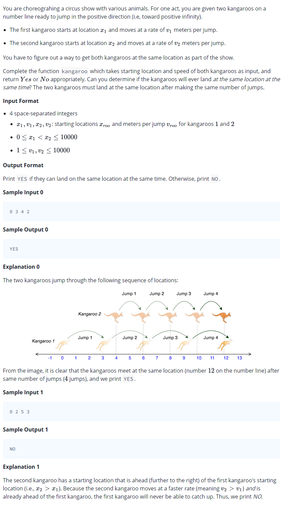

# 0013 [Kangaroo](https://www.hackerrank.com/challenges/kangaroo/problem)



## C

```c
#include <math.h>
#include <stdio.h>
#include <string.h>
#include <stdlib.h>
#include <assert.h>
#include <limits.h>
#include <stdbool.h>

char* kangaroo(int x1, int v1, int x2, int v2) {
    // Complete this function
}

int main() {
    int x1; 
    int v1; 
    int x2; 
    int v2; 
    scanf("%i %i %i %i", &x1, &v1, &x2, &v2);
    int result_size;
    char* result = kangaroo(x1, v1, x2, v2);
    printf("%s\n", result);
    return 0;
}
```

## C++

```cpp
#include <bits/stdc++.h>

using namespace std;

string kangaroo(int x1, int v1, int x2, int v2) {
    // Complete this function
}

int main() {
    int x1;
    int v1;
    int x2;
    int v2;
    cin >> x1 >> v1 >> x2 >> v2;
    string result = kangaroo(x1, v1, x2, v2);
    cout << result << endl;
    return 0;
}
```

## Python 3

```py3
#!/bin/python3

import sys

def kangaroo(x1, v1, x2, v2):
    # Complete this function

x1, v1, x2, v2 = input().strip().split(' ')
x1, v1, x2, v2 = [int(x1), int(v1), int(x2), int(v2)]
result = kangaroo(x1, v1, x2, v2)
print(result)
```