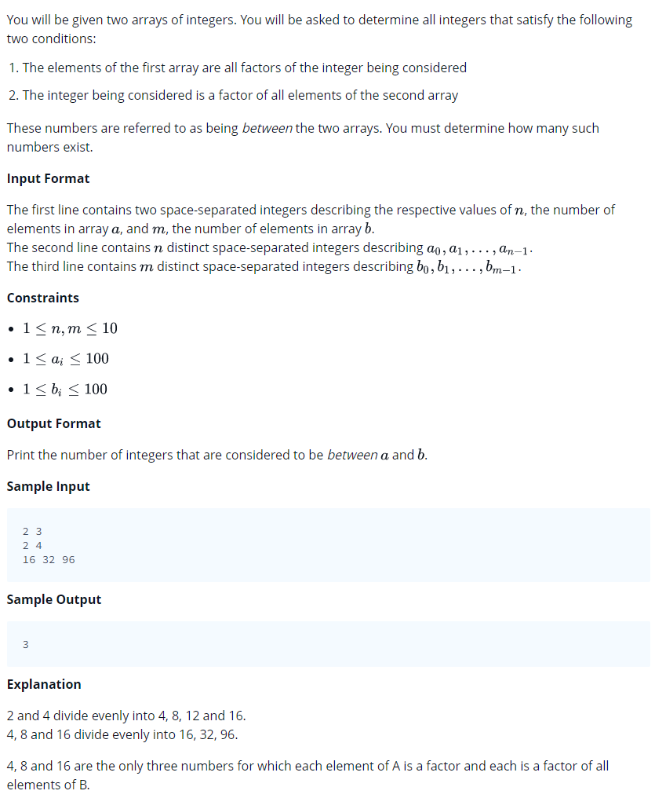

# 0014 [Between Two Sets](https://www.hackerrank.com/challenges/between-two-sets/problem)



## C

```c
#include <math.h>
#include <stdio.h>
#include <string.h>
#include <stdlib.h>
#include <assert.h>
#include <limits.h>
#include <stdbool.h>

int getTotalX(int a_size, int* a, int b_size, int* b) {
    // Complete this function
}

int main() {
    int n; 
    int m; 
    scanf("%i %i", &n, &m);
    int *a = malloc(sizeof(int) * n);
    for (int a_i = 0; a_i < n; a_i++) {
       scanf("%i",&a[a_i]);
    }
    int *b = malloc(sizeof(int) * m);
    for (int b_i = 0; b_i < m; b_i++) {
       scanf("%i",&b[b_i]);
    }
    int total = getTotalX(n, a, m, b);
    printf("%d\n", total);
    return 0;
}
```

## C++

```cpp
#include <bits/stdc++.h>

using namespace std;

int getTotalX(vector <int> a, vector <int> b) {
    // Complete this function
}

int main() {
    int n;
    int m;
    cin >> n >> m;
    vector<int> a(n);
    for(int a_i = 0; a_i < n; a_i++){
       cin >> a[a_i];
    }
    vector<int> b(m);
    for(int b_i = 0; b_i < m; b_i++){
       cin >> b[b_i];
    }
    int total = getTotalX(a, b);
    cout << total << endl;
    return 0;
}
```

## Python 3

```py3
#!/bin/python3

import sys

def getTotalX(a, b):
    # Complete this function

if __name__ == "__main__":
    n, m = input().strip().split(' ')
    n, m = [int(n), int(m)]
    a = list(map(int, input().strip().split(' ')))
    b = list(map(int, input().strip().split(' ')))
    total = getTotalX(a, b)
    print(total)
```