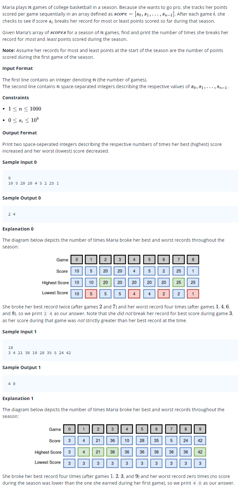

# 0015 [Breaking the Records](https://www.hackerrank.com/challenges/breaking-best-and-worst-records/problem)



## C

```c
#include <math.h>
#include <stdio.h>
#include <string.h>
#include <stdlib.h>
#include <assert.h>
#include <limits.h>
#include <stdbool.h>

int* breakingRecords(int score_size, int* score, int *result_size) {
    // Complete this function
}

int main() {
    int n; 
    scanf("%i", &n);
    int *score = malloc(sizeof(int) * n);
    for (int score_i = 0; score_i < n; score_i++) {
       scanf("%i",&score[score_i]);
    }
    int result_size;
    int* result = breakingRecords(n, score, &result_size);
    for(int result_i = 0; result_i < result_size; result_i++) {
        if(result_i) {
            printf(" ");
        }
        printf("%d", result[result_i]);
    }
    puts("");

    return 0;
}
```

## C++

```cpp
#include <bits/stdc++.h>

using namespace std;

vector <int> breakingRecords(vector <int> score) {
    // Complete this function
}

int main() {
    int n;
    cin >> n;
    vector<int> score(n);
    for(int score_i = 0; score_i < n; score_i++){
       cin >> score[score_i];
    }
    vector <int> result = breakingRecords(score);
    for (ssize_t i = 0; i < result.size(); i++) {
        cout << result[i] << (i != result.size() - 1 ? " " : "");
    }
    cout << endl;

    return 0;
}
```

## Python 3

```py3
#!/bin/python3

import sys

def breakingRecords(score):
    # Complete this function

if __name__ == "__main__":
    n = int(input().strip())
    score = list(map(int, input().strip().split(' ')))
    result = breakingRecords(score)
    print (" ".join(map(str, result)))
```