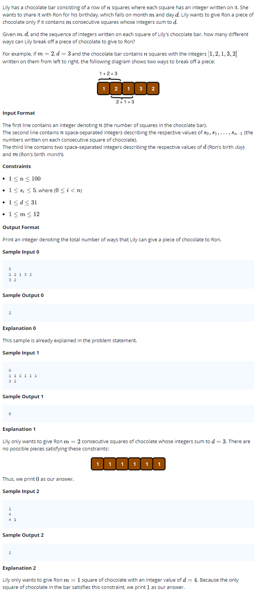

# 0016 [Birthday Chocolate](https://www.hackerrank.com/challenges/the-birthday-bar/problem)



## C

```c
#include <math.h>
#include <stdio.h>
#include <string.h>
#include <stdlib.h>
#include <assert.h>
#include <limits.h>
#include <stdbool.h>

int solve(int n, int s_size, int* s, int d, int m){
    // Complete this function
}

int main() {
    int n;
    scanf("%d", &n);
    int *s = malloc(sizeof(int) * n);
    for(int s_i = 0; s_i < n; s_i++){
       scanf("%d",&s[s_i]);
    }
    int d;
    int m;
    scanf("%d %d", &d, &m);
    int result = solve(n, n, s, d, m);
    printf("%d\n", result);
    return 0;
}
```

## C++

```cpp
#include <bits/stdc++.h>

using namespace std;

int solve(int n, vector < int > s, int d, int m){
    // Complete this function
}

int main() {
    int n;
    cin >> n;
    vector<int> s(n);
    for(int s_i = 0; s_i < n; s_i++){
       cin >> s[s_i];
    }
    int d;
    int m;
    cin >> d >> m;
    int result = solve(n, s, d, m);
    cout << result << endl;
    return 0;
}
```

## Python 3

```py3
#!/bin/python3

import sys

def solve(n, s, d, m):
    # Complete this function

n = int(input().strip())
s = list(map(int, input().strip().split(' ')))
d, m = input().strip().split(' ')
d, m = [int(d), int(m)]
result = solve(n, s, d, m)
print(result)
```