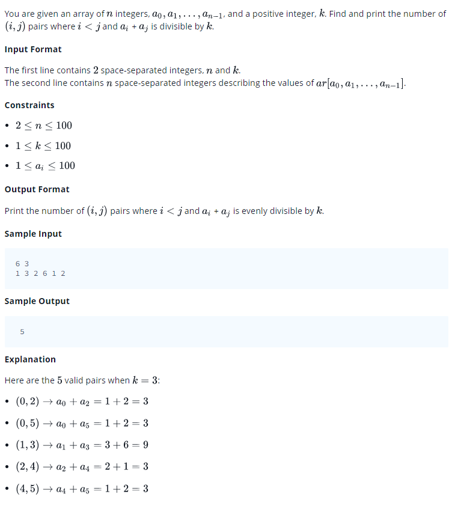

# 0017 [Divisible Sum Pairs](https://www.hackerrank.com/challenges/divisible-sum-pairs/problem)



## C

```c
#include <math.h>
#include <stdio.h>
#include <string.h>
#include <stdlib.h>
#include <assert.h>
#include <limits.h>
#include <stdbool.h>

int divisibleSumPairs(int n, int k, int ar_size, int* ar) {
    // Complete this function
}

int main() {
    int n; 
    int k; 
    scanf("%i %i", &n, &k);
    int *ar = malloc(sizeof(int) * n);
    for(int ar_i = 0; ar_i < n; ar_i++){
       scanf("%i",&ar[ar_i]);
    }
    int result = divisibleSumPairs(n, k, n, ar);
    printf("%d\n", result);
    return 0;
}
```

## C++

```cpp
#include <bits/stdc++.h>

using namespace std;

int divisibleSumPairs(int n, int k, vector <int> ar) {
    // Complete this function
}

int main() {
    int n;
    int k;
    cin >> n >> k;
    vector<int> ar(n);
    for(int ar_i = 0; ar_i < n; ar_i++){
       cin >> ar[ar_i];
    }
    int result = divisibleSumPairs(n, k, ar);
    cout << result << endl;
    return 0;
}
```

## Python 3

```py3
#!/bin/python3

import sys

def divisibleSumPairs(n, k, ar):
    # Complete this function

n, k = input().strip().split(' ')
n, k = [int(n), int(k)]
ar = list(map(int, input().strip().split(' ')))
result = divisibleSumPairs(n, k, ar)
print(result)
```