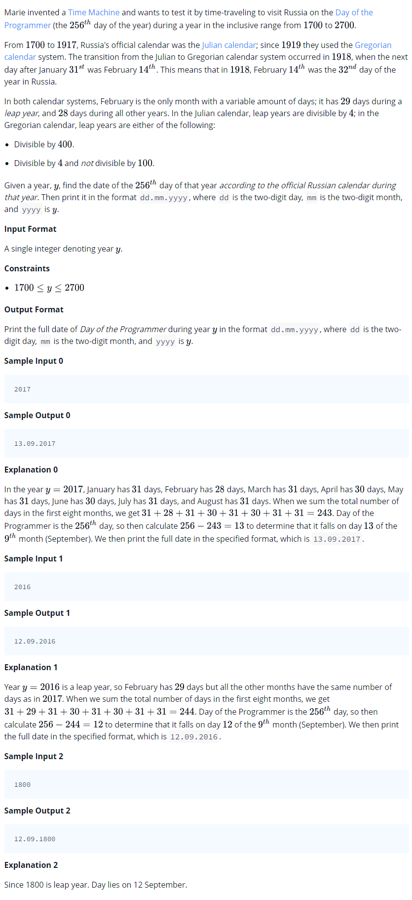

# 0019 [Day of the Programmer](https://www.hackerrank.com/challenges/day-of-the-programmer/problem)



## C

```c
#include <math.h>
#include <stdio.h>
#include <string.h>
#include <stdlib.h>
#include <assert.h>
#include <limits.h>
#include <stdbool.h>

char* solve(int year){
    // Complete this function
}

int main() {
    int year; 
    scanf("%d", &year);
    int result_size;
    char* result = solve(year);
    printf("%s\n", result);
    return 0;
}
```

## C++

```cpp
#include <bits/stdc++.h>

using namespace std;

string solve(int year){
    // Complete this function
}

int main() {
    int year;
    cin >> year;
    string result = solve(year);
    cout << result << endl;
    return 0;
}
```

## Python 3

```py3
#!/bin/python3

import sys

def solve(year):
    # Complete this function

year = int(input().strip())
result = solve(year)
print(result)
```